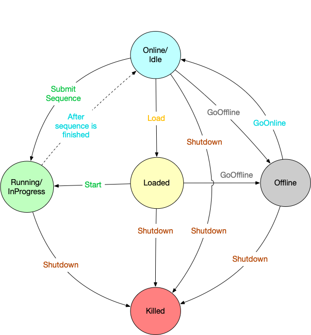
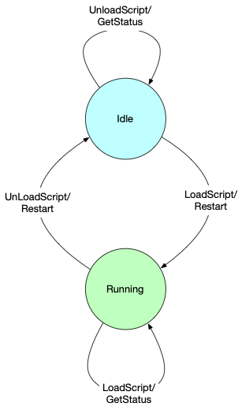

# Sequencer Lifecycle

The Sequencer lifecycle is implemented as a Finite State Machine. At any given time a Sequencer is in exactly
one of those states. The state of the Sequencer is tied to whether or not it has received a Sequence and whether
or not the Sequence has started executing. Sequencer supports a set of commands/messages, and on receiving those commands, it
takes an action and transitions to other states. 

Following are the states supported by the Sequencer:

* **Idle/Online:** This is the default state of the Sequencer. A Sequencer is idle when it is starts up. It has a Script since it
has been loaded by the Sequence Component, but there's no Sequence under execution.
A Sequencer can come to the idle state from the following situations:

    * when the Sequencer starts up for the first time with a Script loaded
    * when the Sequencer has finished execution of a Sequence
    * when the Sequencer was offline, and a goOnline command is sent

* **Loaded:** A Sequencer is in loaded state when a Sequence is received and ready for execution, but execution of the Sequence hasn't started.
A separate `start` command is expected to start execution of the Sequence. 
All sequence editor actions (for e.g. add, remove, reset) are accepted in this state.
From this state, the Sequencer can go to the `InProgress` state
on receiving a `start` command, or it could go to the `offline` state if `goOffline` command is sent. On receiving a `reset` command,
which discards all the pending steps, the Sequencer will go to `idle` state.
 
* **InProgress/Running:** The Sequencer is in `running` state, only when it is executing a Sequence. All sequence editor actions
(for e.g. add, remove, reset) are accepted in this state. From the `running` state, the Sequencer can go to `idle` state on completion of a Sequence,
or it can be `killed`. In order to go `offline` from this state, the Sequencer has to go to `idle` and then `offline`.

* **Offline:** The Sequencer goes in `offline` state, only on receiving a `goOffline` command which can either come from an upstream
Sequencer, or from a user through the admin dashboard. In this state, only a few commands are excepted (for eg. goOnline, shutdown, status etc).   

* **Killed:** This is the final state of the Sequencer. The shutdown command can be sent in any state, hence a Sequencer can transition to this state
from any other state. 

# Sequence Component Lifecycle

The Sequence Component also has a lifecycle, but it is simpler than the Sequencer lifecycle. The following
figure shows the Sequence Component has two states: Idle and Running.

* **Idle:** This is the default state of a Sequence Component when it is started. It is ready for the loading
of a Script that will create a Sequencer.  The `LoadScript` loads a script and creates the Sequencer. If successful, the Sequence
Component transitions to the Running state. While in the Idle state, the Sequence Component responds to the `GetStatus` message
and ignores the `UnloadScript` message without error.

* **Running:** Once a Sequence Component has successfully loaded a Script, it is in the Running state. The new
Sequencer will be available to process Sequences until it receives an `UnloadScript` message and transitions back
to the Idle state. While in Running state, the Sequence Component can also receive a `Restart` message, which causes
the shutdown and unloading of the Script followed immediately by the loading of the script. This has the effect of
initializing the script. The `LoadScript` message is ignored without error while in the Running state. The Sequence
Component responds successfully to the `GetStatus` message.

